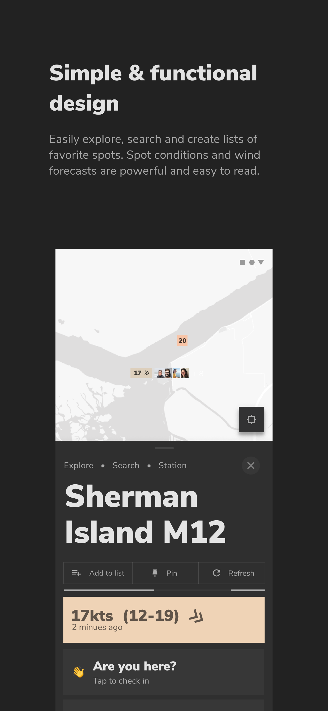
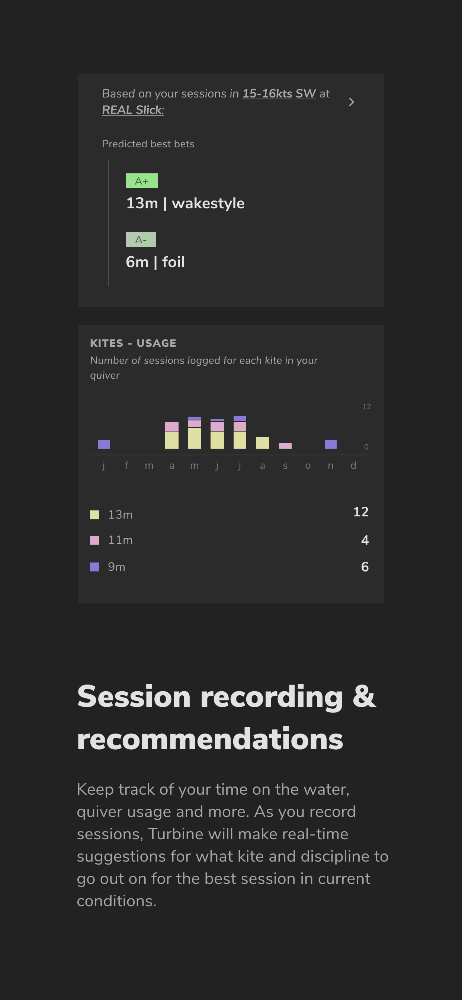

# Turbine

"**Turbine requires an iKitesurf Pro Account**

Turbine is a kitesurf forecasting platform that connects kite spots, conditions and the community.

             |               |               |               |  
:-------------------------:|:-------------------------:|:-------------------------:|:-------------------------:|:-------------------------:

Turbine is powered by iKitesurf and enables you to easily check kitesurfing conditions at your local spot(s) or when exploring new locations. 

On top of its wind & forecasting functionality, Turbine builds unique features specific to kitesurfing, like the ability to record sessions and view statistics like time on the water, average session duration, quiver usage, discipline preferences, most ridden spots, and more. As you record sessions, Turbine learns the conditions in which you ride and is able to give real-time, personalized recommendations for the best kite & discipline for a given spot, right now.  Additionally, Turbine brings the kiting community online by allowing check-ins, condition reporting, and chats for spots. Checking-in to a spot will show your avatar next to the spot on the map and let others know who is kiting where. Crowd reported conditions and chats offer an alternative to station-reported data and are a great way to see what others are saying about real-time conditions.

Wind & forecasting features:

* Explore the map to discover kite spots/weather stations
* Search by name, zip or keyword
* Create lists of your favorite spots
* View real-time wind observation data
* View wind forecasts and choose between forecasting models
* View pro forecasts
* View easy-to-read tide charts

Session features:

* Record sessions
* Get personalized, real-time recommendations for what kite and discipline you should go out on for a spot's current conditions, based on your previously recorded sessions. 
* View your overall kiting statistics (total sessions, duration, quiver usage, discipline preferences, and more)
* View data for individual sessions (avg. wind speed, wind direction, duration, etc)

Community features:

* Check-in to spots to let others know who's there
* See  who's checked-in to a spot by panning the map or viewing a list on a spot's page
* Report local wind and kite conditions for spots
* See reported conditions and chats from other riders at spots"
